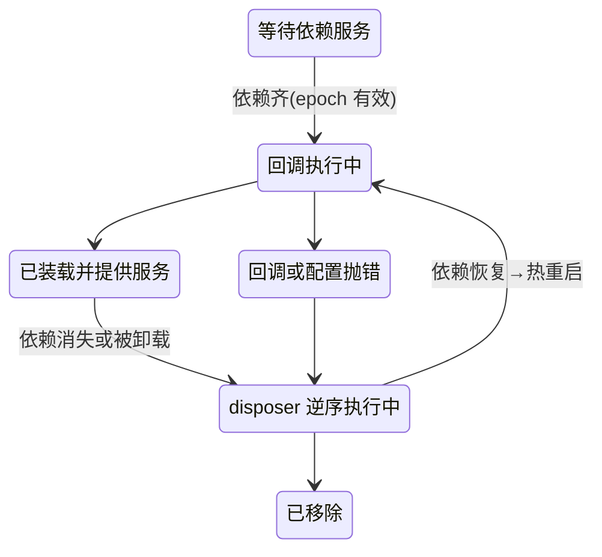

# Cordis 内核：上下文、服务与纤绳（fiber）

[English](cordis-kernel.md) | [中文](cordis-kernel.zh.md)

> Cordis（`vendor/cordis/`，`@deepseek-ai/cordis` v4.0.2）是 DSH 的底层插件框架。
> 内核只有 9 个源文件（最大 `fiber.ts` ≈25KB），但整个"一切皆插件"架构的地基全在这。
> 术语：**插件**（plugin）= 一段挂载进上下文的安装代码；**服务**（service）= 挂在
> `ctx.<key>` 上的具名能力；**纤绳**（fiber）= 一次插件装载的运行时句柄。

## 五个核心概念（一表打尽）

| 概念 | 实现要点 | 源码 |
|---|---|---|
| 插件 | 三种形态：函数 `(ctx, config)`、类（`Service` 子类）、`{ apply }` 对象；元数据 `name/Config/inject/provide` | `vendor/cordis/src/registry.ts` |
| 上下文 | 依赖容器，**运行时是 Proxy**：普通属性读走服务解析；`extend/isolate/intercept` 派生子作用域 | `context.ts`、`reflect.ts` |
| 依赖声明 | `inject` 列所需服务，齐了才激活；加载顺序=依赖关系，**没有手工启动序列** | `registry.ts`、`fiber.ts` |
| 类型化事件 | 5 种分发模式（下表）；监听器随所属 fiber 自动摘除 | `events.ts` |
| 可逆副作用 | `ctx.effect(fn, label)` 返回 disposer；fiber 卸载时**逆序启动、并发完成**（单 effect 自身内部才是严格逆序串链——深读澄清） | `fiber.ts` |

## 事件分发模式（`events.ts`）

| 模式 | await? | 语义 | 典型用途 |
|---|---|---|---|
| `emit` | 否 | 按注册序观察，忽略返回值 | 通知（`agent/created`） |
| `parallel` | 是 | 全部并行，聚合错误 | 检查点（`session/flush`） |
| `serial` | 是 | 按序 await，遇 bail 值即停 | 终检（`agent/turn-stopping`） |
| `bail` | 否 | 同步直到某监听器返回非 null/false/undefined | 短路问询 |
| `waterfall` | — | 洋葱中间件：`(…args, next)`，不调 `next()` 即否决 | 策略拦截（`tools/pre-execute`） |

`Events` 类型面靠 TypeScript **声明合并**扩展：任何包都能
```ts
declare module '@deepseek-ai/cordis' { interface Events { 'x/y'(…): void } }
```
不改框架源码就给事件总线加新事件——这是 DSH 扩展体系的基座。

## 上下文作用域三原语（`context.ts`）

- `extend(meta)`：子上下文，原型链继承，meta 遮蔽而不改父级。
- `isolate(name, label)`：为某服务开独立作用域——同名服务在不同 label 下可并存不同
  实现。**per-agent 服务覆盖**（一个 agent 用自己的工具表/存储）就靠它。
- `intercept(name, config)`：给子树内的服务配置注入拦截项，沿原型链按序 merge
  （`Service[resolveConfig]`）。**preset/profile 用同一份代码注入不同配置**。

`ReflectService` 的 Proxy handler（`reflect.ts`）实现读取规则：先查本 fiber 的
`store`（inject 时快照的依赖实现）→ 沿父链找同 isolate label 的 store →
未声明 inject 的读走 `internal/get` waterfall（可被拦截/诊断）。服务实现记录
`Impl { name, fiber(所有者), value, check? }`：`provide` 即注册，**随所属 fiber 卸载自动注销**，
注销会唤醒依赖方（notify → 依赖方 epoch 变化 → 自动重启）。

## 纤绳生命周期（`fiber.ts`）



- **epoch 指纹**：`':' + 依赖fiber.uid` 拼接串。任一依赖换实现 → 串变 → 本 fiber
  自动 unload→reload **就地重放**（不经过 PENDING 停靠，PENDING 只在依赖彻底缺席时出现）。
  这就是"换个 patch 行就换掉整个子系统"且不留残余状态的机制；全链内幕见
  [Cordis 热重启与热重载内幕](../deep/cordis-hot-reload.zh.md)。
- **effect 树**：每个 effect 带 label 与 children（`EffectMeta`），可整树 dump 诊断；
  生成器 effect（`function* { yield disposer }`）支持流式注册。
- **配置校验**：插件声明 `Config`（任何实现 `@standard-schema/spec` 的校验器，
  DSH 用 `schemastery`/`zod`），启动前同步校验，失败抛 `ValidationError`。

## 一次 `ctx.plugin(P)` 的完整装载链

1. Registry 按 `callback` 函数身份建/复用 `Plugin.Runtime`；
2. `new Fiber`：父 fiber 的 effect 持有其 dispose（子随父亡）；
3. `emit('internal/plugin')` → 逐依赖 `_checkImpl`（含 `check` 可用性谓词）；
4. `_refresh` 算 epoch → 有效则 `_reload`：`internal/config` waterfall → schema 校验
   → 执行回调（`isConstructor` 判别 new 或调用）→ 收集 effect → ACTIVE；
5. 依赖缺失则保持 PENDING，等待 notify 唤醒。

## 为什么这套设计对 harness 重要

- 策略与功能同构：审批、压缩、重试、钩子桥全是"多挂一个监听器/再提供一个服务"，
  没有 if-else 特判点 → 功能可被组合包逐层替换。
- 生命周期即资源管理：不依赖 GC 直觉，一切注册显式可逆 → 长时间运行的宿主
  可以放心热载/热卸。

## 相关

- 上层组装（loader/patch/profile）：[插件组装与启动](./plugin-composition.zh.md)
- 主干如何消费这些服务：[turn/step 主循环](../agent-runtime/turn-step-loop.zh.md)
  · [工具注册表与执行流水线](../agent-runtime/tools-pipeline.zh.md)
