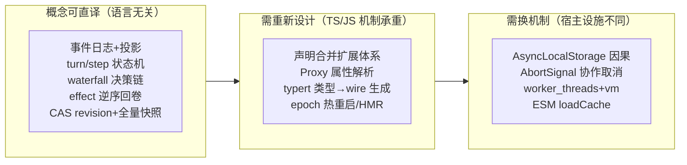

# Java 移植观察地图

> 本页只**汇总事实性观察**（哪些机制绑定 Node/TS、哪些概念语言无关），
> **不是设计方案**——"Java 版该怎么做"属于未来目标书/计划书的内容。

## 一图：三个移植难度带

## 语言无关、可照搬的概念（六路共识）

| 概念 | 出处 | 一句话本质 |
|---|---|---|
| 仅追加事件日志=唯一真源 | core/llm/platform | "模型可见即已记录"；回放/fork/审计/压缩改写全靠它 |
| surface append/replace + `replaceGeneration` | core | 改写历史=追加检查点，不删事实 |
| 投影=纯同步 fold + `stateVersion` + 读阶梯 | platform | checkpoint→tail replay→full refold；不透明 revision 令牌 |
| turn/step 相位机 + inbox 唯一输入闸 | core | claim-then-enter；被拒批次保持已移除；注入静躺等唤醒 |
| waterfall/serial/emit 三模式 + 作用域路由 | 全局 | 拦截=中间件（不调 next 即否决）；终检=serial；通知=emit |
| 并行派发、按模型序提交、fail-closed 并发分类 | core | 日志顺序=模型感知顺序，恢复无歧义 |
| 单调 deny-only guard + 'ask' 缺席即 deny | core | 审批翻案不可能；默认关死 |
| 能力 seam 三件套（Definition/Provider/Consumer） | 全局 | 换提供方=换整条执行世界；单 context 单实现=注册即冲突报错 |
| 先持久化后生效（retry marker/inbox splice/jobs first-wins） | llm/core | 可取消等待之前事实已落盘 |
| 事件驱动热配置（每操作 resolve 凭据；settings CAS） | platform | 无重启热轮换；在途流保持旧事实 |
| 状态推导而非第二状态机（Activation=subagent 停稳+ownedChildren） | augmentation | 真相只有一份，派生视图可重算 |
| 定时器=普通消息生产者 | augmentation | 不为调度发明第二输入通道 |
| `ignorable` 前向兼容标记 + 严格 decoder | core/llm | 旧读新、新读旧都不炸；版本复用 id 直接拒 |
| 观察/决策/持久 三类事件分离 + listener 故障隔离 | 全局 | 通知失败绝不否决注册；错误按领域所有者分层 |
| 启动审计 fail-loud（点名 FAILED/PENDING 缺服务） | boot | 配置了没起来≠静默运行 |

## 绑定 TypeScript 类型系统的机制（移植最大分叉）

1. **声明合并（declaration merging）是扩展体系基座**：`Events`、`Context`、
   `SessionEventMap`、`JobKindMap`、`SubagentStopReasonMap`、
   `ContentBlockMap`…——"不改拥有包即加事件/服务/联合变体"。
   Java 无编译期开集类型；候选对应：SPI+注册表（失编译期检查）、注解处理器/代码生成
   （恢复编译期但换构建复杂度）。**这是全库使用密度最高的 TS 特性**（六路摘要都独立点名）。
2. **Proxy trap 实现 ctx 属性解析**（`reflect.ts`）：Java 只能显式
   `ctx.get(Service.class)`；inject 快照、traceable 重绑定、`internal/get/set`
   拦截都挂在这个 trap 上。
3. **branded type**（`SessionId/SessionSeq/ToolCallId`，`packages/util/brand`）：
   编译期防 id 混用；Java=包装 record（样板换类型安全）。
4. **typert**：构建期 ts.Program 静态分析 → descriptor + Zod schema + 双端产物。
   Java 对应物=注解处理器生成 wire 契约（概念可平移，生态需自建——
   类比"没有现成 typert"是移植的独立工程量项）。
5. **schemastery/zod 双身份 schema**（校验+JSON Schema 导出，驱动配置 UI/工具定义）：
   Java 候选：networknt/json-schema-validator + 注解，同样"schema 单源多消费"。

## 绑定 Node 运行时的设施（需换机制）

- `AsyncLocalStorage`（initiator 因果归属）→ ScopedValue(JEP 481)/结构化并发 [VERIFY 成熟度]；
- `AbortController/Signal(+reason)` 贯穿全链的协作取消 → `Future.cancel(mayInterruptIfRunning)`/
  structured scope；DSH 的"signal 可换不可去""三源融合"语义要逐点重做；
- HMR（ESM loadCache 失效）→ JVM 无对等物（classloader 游戏）；
  **可放弃**：patch 热重启子系统这层价值在配置组合，不在模块级热替换（观察：
  DSH 自己也规定 headless/sdk 只应用一次配置）；
- `worker_threads + node:vm`（workflow realm 隔离）→ 虚拟线程 + 真子进程/独立 JVM 沙箱；
  ——[VERIFY 执行群摘要补充；对应 DSH 里远程沙箱提供方 e2b 也走"换执行世界"正路]；
- POSIX 文件语义（`'wx' 0o600` 独占创建、realpath 唯一性）→ Java NIO
  `StandardOpenOption.CREATE_NEW` + `PosixFilePermissions`（POSIX/NTFS ACL 双态
  需另核，Windows 语义 [VERIFY]）；
- `koffi` FFI 直调 `advapi32`（Windows 沙箱令牌/ACE）、`node-pty` + `@xterm/headless`
  （PTY 与仿真渲染）、npm `os/cpu` 平台包分发原生二进制（landlock-run launcher）
  → Java 侧对应 JNA/Panama(FM) + 自带构建矩阵，属体力活而非概念活；
- `stripTypeScriptTypes`（node:module）+ `structuredClone` + Worker
  `resourceLimits`/`eventLoopUtilization` 构成 code-runtime 本地后端 → Java 跑模型
  生成的代码需另选宿主（JSR-223/GraalVM/子 JVM），但"预算+敌意边界+即时回传"
  协议可照搬；
- `Promise/微任务时序假设`（emit 同步、disposer 逆序、"完成通知最后发"）→
  移植时必须把"单线程事件循环"显式化：要么真单线程 actor 化，要么每处时序依赖重审。

## 工程纪律层（与语言无关、但同样要移植的"护城河"）

- 文档=生成+验证：`gen-cordis-catalog/gen-tool-catalog/…` + `verify-*` 全家桶，
  doc-sync 保证子系统页与源码永不漂移——**架构知识的基础设施化**；
- **每包 invariant 伴生插件**（`ctx.invariants` 注册表 + `verify-package-invariants`
  机械拒绝空安装器）：运行时契约不是注释，是可执行断言；
- `verify-application-entrypoints`（一切 Node 应用走 launcher）；
  `verify-*-pairing`（中英双语对侧同步）；`rules budget`（组级规范同款思想：
  规则须报"防什么事故"）。
- `AGENTS.md/.agents/notes` 决策档案 + postmortem 目录：
  架构演进记忆显式落盘（本项目规范与它同构，可直接抄其颗粒度）。

## 各子系统"移植前置件"清单（依赖方向事实）

主干（core+llm+session 词汇）依赖 cordis 框架语义 + schemastery + brand + util；
不依赖 web/host/client 任何一层——**最小可用 harness（headless）≈ cordis + core + llm
+ 本地执行世界**，其余皆为可拆增强（bundle/base 与 sdk-minimal 两个组合包的差异
就是官方给出的"最小核/全家桶"标本）。

## 相关

- 全部细节篇：[dsh-harness 主题导航](./dsh-harness-index.md)
