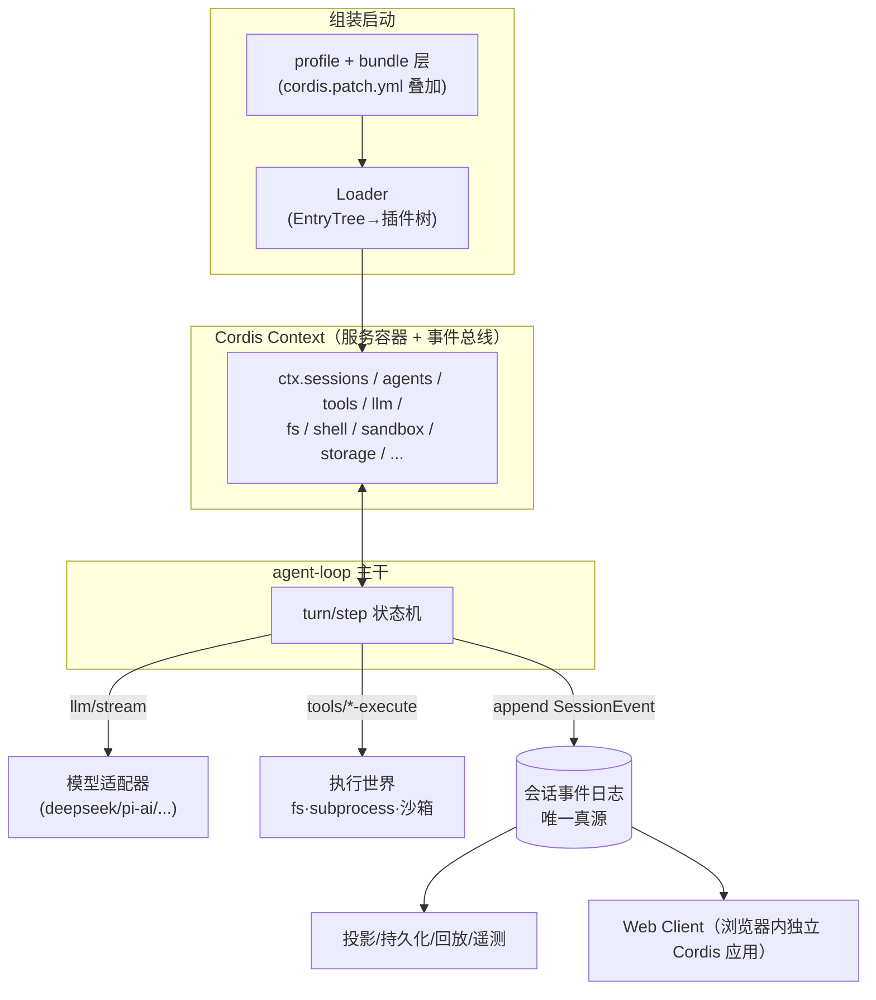

# DSH 源码架构总览

> DeepSeek Harness（`dsh`）= DeepSeek 开源的 LLM agent harness，"一切皆插件"架构，
> 由 Cordis 框架驱动（设计论文 *A Programming Paradigm for Spatiotemporal Composability*）。
> 本页是整个 dsh-harness 主题的导航与全景；细节进入各分篇。

## 一句话架构

**一棵 Cordis 插件树**：启动时把 profile（组合包层 + patch 层）叠成配置树 →
Loader 按依赖就绪顺序实例化插件 → 插件向共享 `Context` 提供/消费`服务`，
用`类型化事件`做拦截与扩展 → 主干（agent loop）消费这些服务驱动模型轮次 →
会话事件日志是唯一真源，UI/持久化/压缩/遥测全部从日志投影派生。

## 分层导航

| 层 | 内容 | 分篇 |
|---|---|---|
| 框架地基 | Cordis 内核：Context/Service/Fiber/事件 | [Cordis 内核](./cordis/cordis-kernel.md) |
| 组装启动 | loader/include/patch、profile/bundle、dsh 启动序 | [插件组装与启动](./cordis/plugin-composition.md) |
| Agent 主干 | 会话日志、turn/step 循环、工具流水线、提示词组装 | [会话事件日志](./agent-runtime/session-event-log.md) · [turn/step 主循环](./agent-runtime/turn-step-loop.md) · [工具注册表与执行流水线](./agent-runtime/tools-pipeline.md) |
| 模型层 | LLM 词汇、适配器、重试、计量与压缩 | [LLM 层](./llm-layer/llm-vocabulary.md) · [上下文工程](./llm-layer/context-engineering.md) |
| 执行世界 | fs/沙箱/进程/shell/终端/LSP/code-runtime | [文件系统与沙箱](./execution/filesystem-and-sandbox.md) · [进程、shell 与终端](./execution/shell-process-terminal.md) · [代码运行、LSP 与远程世界](./execution/remote-and-code-runtime.md) |
| 平台层 | 持久化、storage、host/client、API 网关、应用壳 | [会话持久化与存储](./platform/session-persistence.md) · [host/client 分层与 API 网关](./platform/host-client-boundary.md) |
| 增强层 | subagent/skill/goal/workflow/jobs/MCP/hooks | [委派与编排](./augmentation/subagent-orchestration.md) · [能力供给](./augmentation/skills-mcp-hooks.md) · [自组织](./augmentation/goal-plan-todo.md) · [人机问答与反馈](./augmentation/questions-and-answers.md) · [后台任务与外部触发](./augmentation/background-and-triggers.md) · [配置面](./augmentation/settings-and-credentials.md) |
| 专题深读 | 六路源码级走读与真机实测（`deep/`，修正概览篇开放问题） | [深读索引](./dsh-harness-index.md) |

## 全景图

## 关键设计决定（为什么这样设计）

1. **没有特权内核**：模型适配器、工具注册表、会话日志、循环本身都是插件，
   全部可被一行 patch 替换（`docs/architecture.zh.md`）。
2. **模型可见即已记录**：抵达模型的一切必须能从事件日志重建，并有运行时不变量断言。
3. **能力 seam 三件套**：Service Definition + Provider + Consumer 一起设计；
   把 fs 与进程提供方指向远程沙箱，Bash/PTY/LSP 一起搬家（`docs/architecture.zh.md`）。
4. **注册即可逆副作用**：一切监听器/工具/提示词段经 `ctx.effect()` 登记，
   插件卸载时逆序撤销 → 热重载安全。

## 规模速览

- monorepo：`packages/` 55 组、`apps/{cli,web}`、`vendor/`（cordis 等 8 个上游同步副本）、
  `native/landlock-run`（Linux 沙箱辅助）、`python/`（Python SDK 打包 dsh CLI）。
  源码文件计数为一次性统计（`[ESTIMATED]` 口径：按 `.ts/.tsx/.md` 等后缀 walk 计数）。
- 官方文档密度极高：`docs/subsystems/` 51 篇 + cookbook + 生成的目录（工具/配置/事件/持久化），
  且经 `scripts/gen-*.ts` 与 `verify-*` 保证**文档与源码同步**——读架构从文档进、拿源码核。

## 相关

- 主题导航见 [dsh-harness 主题导航](./dsh-harness-index.md)；写作约定：中文行文、代码标识符保留英文、
  证据一律写源码仓库相对路径（各篇 frontmatter `evidence:` 声明基线）。
