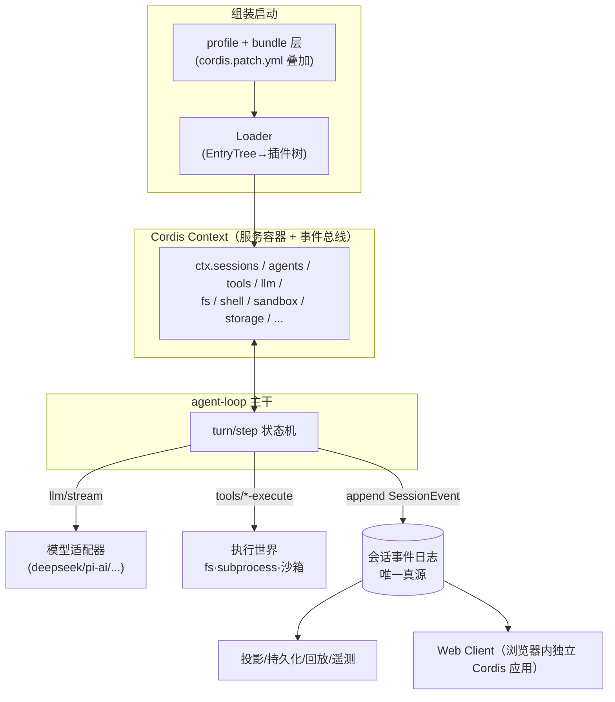

# DSH 源码架构总览

[English](overview.md) | [中文](overview.zh.md)

> DeepSeek Harness（`dsh`）= DeepSeek 开源的 LLM agent harness，"一切皆插件"架构，
> 由 Cordis 框架驱动（设计论文 *A Programming Paradigm for Spatiotemporal Composability*）。
> 本页是整个 dsh-harness 主题的导航与全景；细节进入各分篇。

## 一句话架构

**一棵 Cordis 插件树**：启动时把 profile（组合包层 + patch 层）叠成配置树 →
Loader 按依赖就绪顺序实例化插件 → 插件向共享 `Context` 提供/消费`服务`，
用`类型化事件`做拦截与扩展 → 主干（agent loop）消费这些服务驱动模型轮次 →
会话事件日志是唯一真源，UI/持久化/压缩/遥测全部从日志投影派生。

## 分层导航

- 框架地基 —— Cordis 内核：Context/Service/Fiber/事件
  - [Cordis 内核](./cordis/cordis-kernel.zh.md)
- 组装启动 —— loader/include/patch、profile/bundle、dsh 启动序
  - [插件组装与启动](./cordis/plugin-composition.zh.md)
- Agent 主干 —— 会话日志、turn/step 循环、工具流水线、提示词组装
  - [会话事件日志](./agent-runtime/session-event-log.zh.md)
  - [turn/step 主循环：agent loop 的心脏](./agent-runtime/turn-step-loop.zh.md)
  - [工具注册表与执行流水线](./agent-runtime/tools-pipeline.zh.md)
  - 深读 [Agent 主干内幕](./deep/agent-loop-internals.zh.md)
  - 深读 [提示词组装与运行时上下文](./deep/prompt-assembly-context.zh.md)
- 模型层 —— LLM 词汇、适配器、重试、计量与压缩
  - [LLM 层：统一词汇与适配器](./llm-layer/llm-vocabulary.zh.md)
  - [上下文工程](./llm-layer/context-engineering.zh.md)
- 执行世界 —— fs/沙箱/进程/shell/终端/LSP/code-runtime
  - [文件系统与沙箱：一个执行世界](./execution/filesystem-and-sandbox.zh.md)
  - [进程、shell 与终端](./execution/shell-process-terminal.zh.md)
  - [代码运行、LSP 与远程世界](./execution/remote-and-code-runtime.zh.md)
- 平台层 —— 持久化、storage、host/client、API 网关、应用壳
  - [会话持久化与存储](./platform/session-persistence.zh.md)
  - [host/client 分层与 API 网关](./platform/host-client-boundary.zh.md)
  - [应用壳](./platform/web-cli-boot.zh.md)
  - 深读 [派生侧深读：投影、标题、遥测与格式代次](./deep/session-projection-telemetry.zh.md)
  - 深读 [会话查询内幕](./deep/session-query.zh.md)
- 增强层 —— subagent/skill/goal/workflow/jobs/MCP/hooks
  - [委派与编排：subagent、workflow、Ralph、agent team](./augmentation/subagent-orchestration.zh.md)
  - [能力供给：skills、commands、MCP、hooks、preset](./augmentation/skills-mcp-hooks.zh.md)
  - [自组织：goal、plan mode、todo、schedule](./augmentation/goal-plan-todo.zh.md)
  - [人机问答与反馈：userQuestions 与 feedback](./augmentation/questions-and-answers.zh.md)
  - [后台任务与外部触发](./augmentation/background-and-triggers.zh.md)
  - [配置面：settings、credentials、workspace](./augmentation/settings-and-credentials.zh.md)
- 专题深读 —— 29 篇源码级走读与真机实测（`deep/`，组级全覆盖 51 包组）
  - [dsh-harness 主题导航](./dsh-harness-index.zh.md)（承接表即「谁管什么」索引）

## 全景图

## 覆盖与取舍

> **覆盖面**：本库以 deep/ 29 篇对 `packages/` 51 个包组做到**组级全覆盖**
> （每组至少一篇主承接，承接表见[主题导航](./dsh-harness-index.zh.md)）；概览层 22 篇
> 负责叙事入口。数字与行为口径以 2026-09 源码 checkout 为准，各篇 `evidence:`
> 写仓库相对路径、可复核。
> **有意取舍**：① 38 个 `ui-*` 包按"架构级一篇 + 组内目录表逐包一句话"承接
> （[Web Client](./deep/web-client-architecture.zh.md)），不逐包成节；
> ② experimental 组的 inspector/webworker 内部机制点到为止并如实登记在该篇
> 「诚实边界」；③ `test-support`/`util` 归一篇工程基建按机制组织
> （[工程基建](./deep/engineering-base.zh.md)），不逐包流水账；
> ④ 凡"现行已实现/已修正"标注均带两时点口径（深读基线 vs 2026-09-05 复核），
> 上游快跑时请优先怀疑**无日期**的数字。

## 关键设计决定（为什么这样设计）

1. **没有特权内核**：模型适配器、工具注册表、会话日志、循环本身都是插件，
   全部可被一行 patch 替换（`docs/architecture.zh.md`）。
2. **模型可见即已记录**：抵达模型的一切必须能从事件日志重建，并有运行时不变量断言
   ——断言的执法层是[运行时不变量](./deep/invariants-registry.zh.md)；**挂载面有两口径**：
   伴生全量挂载目前仅在 sdk-minimal 诊断组合，生产 bundle 默认零挂载。
3. **能力 seam 三件套**：Service Definition + Provider + Consumer 一起设计；
   把 fs 与进程提供方指向远程沙箱，Bash/PTY/LSP 一起搬家（`docs/architecture.zh.md`）。
   活标本与验证：[LSP 与 E2B 远程世界](./deep/lsp-e2b-remote.zh.md)（逐环接线链）、
   [Web 工具](./deep/web-tools.zh.md)（一 seam 两操作四提供方的最干净形状）；
   成文的例外=SDK client（裸 spawn 共享环境清洗基座，见 [SDK 三件套](./deep/sdk-embedding.zh.md)）。
4. **注册即可逆副作用**：一切监听器/工具/提示词段经 `ctx.effect()` 登记，
   插件卸载时逆序撤销 → 热重载安全。

## 规模速览

- monorepo：`packages/` 51 组、`apps/{cli,web}`、`vendor/`（cordis 等 8 个上游同步副本）、
  `native/landlock-run`（Linux 沙箱辅助）、`python/`（Python SDK 打包 dsh CLI）。
  `packages/util/`（13 包）是唯一全仓公共底座——**库不是插件，不进插件图**
  （机制组织见 [工程基建](./deep/engineering-base.zh.md)）。
  源码文件计数为一次性统计（`[ESTIMATED]` 口径：按 `.ts/.tsx/.md` 等后缀 walk 计数）。
- 官方文档密度极高：`docs/subsystems/` 51 篇 + cookbook + 生成的目录（工具/配置/事件/持久化），
  且经 `scripts/gen-*.ts` 与 `verify-*` 保证**文档与源码同步**——读架构从文档进、拿源码核。

## 相关

- 主题导航见 [dsh-harness 主题导航](./dsh-harness-index.zh.md)；写作约定：中文行文、代码标识符保留英文、
  证据一律写源码仓库相对路径（各篇 frontmatter `evidence:` 声明基线）。
